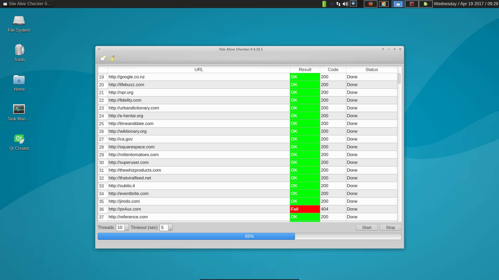

# Site Alive Checker

### About

PyQt5 multithreaded application for checking http response status of urls.

### Screenshot



### Requirements

Application is tested with python 3.5.2 version.

```
pip install -r requirements.txt
```

### Aditional Python Libraries

- [lxml](https://github.com/lxml/lxml/)
- [requests](https://github.com/kennethreitz/requests)
- [PyQt5](https://github.com/baoboa/pyqt5)

### Installation

```
git clone https://github.com/fuzzy69/site-alive-checker.git

```